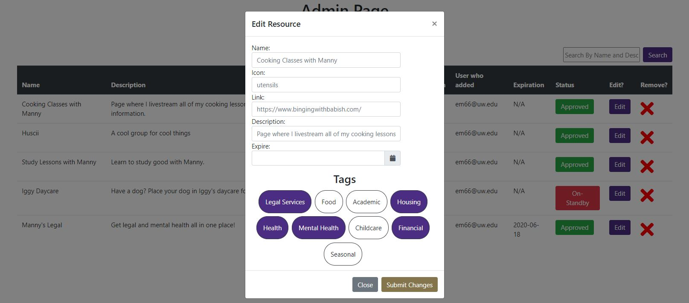

# ResourceTracker Manual
This is the manual for the ResourceTracker application. ResourceTracker allows students to view the
currently available resources on campus. It also allows faculty and staff to add and approve of
resources.

## Table of Contents
1. [Viewing resources as a student](#viewing-resources-as-a-student)
2. [Adding Resources](#adding-resources)
3. [Managing Resources](#managing-resources)

### Viewing resources as a student
To view resources as a student, simply go [here](https://depts.washington.edu/uwtslwebdev/ResourceTracker/).
This is also the home page for the ResourceTracker application. From here, you can see all of the
resources that do not belong to a specific category.

You can click on a category to view resources that belong to said category. If you no longer wish to
see the resources under said category, simply click it again. You can select multiple categories
all at once which will show resources that belong to any one of the selected categories.

You can also use the search bar to search for resources that contain in the name or in the Description
what you have typed in.

Upon clicking on a resource, you will see its description and a link to the resource.

### Adding Resources
To add a new resource, simply go [here](https://depts.washington.edu/uwtslwebdev/ResourceTracker/form/).

_**PLEASE NOTE:**_ You must have a valid UWNETID to add a new resource.

From here, you can type in the name of the resource, the link to it, the icon to display for it,
an expiration date (if applicable), the categories the resource goes under, and the description for
the resource.

**ALL** textboxes (except for expiration date) **MUST** be filled in. You will not be able to submit
until they are all filled in.

The resource name will be the first thing a user will see regarding the resource, as well as the icon.

The icon should be something that can represent what the resource is or does. Icons **MUST** be the name
of a font-awesome icon which you can find [here](https://fontawesome.com/icons?d=gallery&m=free).

The resource description will be the that the user sees when they have clicked on the resource. Ideally,
you go into detail about what the resource is, who it is for, etc.

The resource link will be where the user will be taken to if the user clicks on the "Resource Link" button when viewing the resource.

_**PLEASE NOTE:**_ Please make sure the link starts with "http://" or "https://".

For the categories, it is recommended you select at least one. Please check all of the categories
that the resource can belong to. If you did not mean to select one, simply click on it again to de-select it.

Once all of the information has been added, click on "Submit". New resources are placed on standby (Unless you are an admin)
and **MUST** be approved by an admin before they are visible on the website.

### Managing Resources

To manage resources, simply head [here](https://depts.washington.edu/uwtslwebdev/ResourceTracker/admin/).

_**PLEASE NOTE:**_ Access to the managing page is restricted to the **Office of Student Advocacy and Support**.

From the managing page, you can see _all_ of the resources both approved and on-standby resources.

Approved resources are visible on the home page.

On-Standby resources are **NOT** visible on the home page and must be approved before they become visible.

The managing page displays all of the resources and their info. You can see the name, description,
link, a small version of the icon, the user who added the resource, the expiration date if it has one,
the current status of the resource, an edit button to edit the resource, and a remove button to
permanently delete the resource.

For the resource status, if it is green, the resource is approved and is visible on the home page.

If it is red, the resource is on-standby and is **NOT** visible on the home page.

To change the status of the resource, click on the Resource Status button. This will flip the
status of the resource from Approved to Standby and vice versa.

To edit the information of a resource, click on the "Edit" button which will bring up the edit view
for the resource.

From the edit view, you can edit the all of the information regarding a resource. You can see all of
the current information regarding a resource.

For the pieces of information you want to change, type in the new value inside the box.
For the pieces of information you want to stay the same, leave it blank.

Under the tags section, you can change what categories the resource appears under.

To change the categories in which the resource appears under, click on the category you want to
change. Clicking on one will flip the status from colored-in to without-color and vice versa.

If the category is colored-in, the resource will display under that category.
If the category is without color, the resource does not currently display under that category.

Once you had made all of the changes you wanted, click on the "Submit" button to submit all of the
changes.

**PLEASE NOTE:** Changes will not be made live **UNTIL** you have clicked on the "Submit" button.

If you want to cancel any changes, click on "Cancel".

